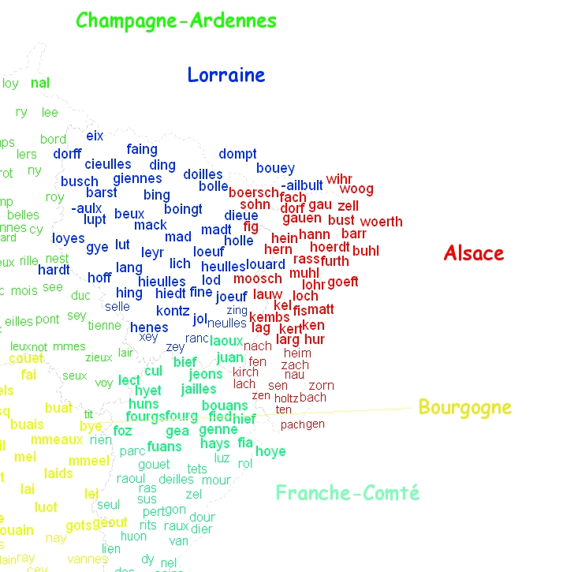

# Analyse des suffixes des communes

[Ce script](suffixes-communes.R) permet d'extraire les noms de communes les plus fréquents par région.

En l'occurrence, il s'appuie sur des règles d'expression régulière visant à extraire la dernière syllabe d'un nom et sur une analyse factorielle, afin de déterminer les syllabes finales les plus caractéristiques.

Il génère également une carte des fins de communes les plus caractéristiques sous la forme d'un nuage de mots.

## Articles associés

https://datagistips.hypotheses.org/86

https://shsoutsiders.wordpress.com/2021/02/05/un-nuage-des-sons-regionaux/

## Cartes

